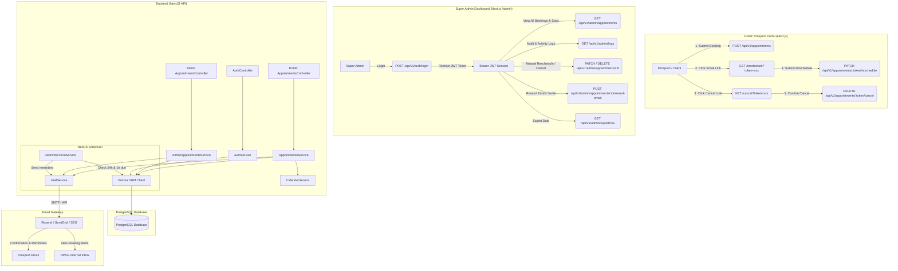

# Appointment Scheduling & Super Admin Management System

## Full-Stack Architecture & Implementation Specification

### Stack: NestJS + Prisma ORM + PostgreSQL + Next.js (App Router)

> **Target Platform:** North Point Sales Group Appointment Booking & CRM Portal  
> **Backend:** NestJS, TypeScript, Prisma ORM, PostgreSQL, `@nestjs/jwt`, `@nestjs/passport`, `@nestjs/schedule`, Nodemailer / Resend  
> **Frontend:** Next.js (App Router), React, Tailwind CSS  
> **Security Model:** Dual-Tier (Passwordless Token for Prospects + JWT Auth for Super Admin)

---

## 1. Executive Summary & Dual-Tier Architecture

The system is structured into two distinct access tiers:

```
┌──────────────────────────────────────────────────────────────────────────────────┐
│                             APPOINTMENT SYSTEM ACCESS TIERS                      │
├────────────────────────────────────────┬─────────────────────────────────────────┤
│          TIER 1: PUBLIC PROSPECT        │          TIER 2: SUPER ADMIN & TEAM     │
├────────────────────────────────────────┼─────────────────────────────────────────┤
│ • Zero friction (No Signup / No Login)  │ • Secure Protected Portal (JWT)  │
│ • Books via website form               │ • Super Admin Pre-seeded (No Public reg)│
│ • Receives Instant Email & Invites     │ • Complete CRM / Master Data Access     │
│ • Reschedules/Cancels via UUID Token   │ • Search, Filter, Stats & Analytics     │
│ • Receives 24h & 1h Auto-Reminders     │ • Manual Overrides, Resend & CSV Export │
└────────────────────────────────────────┴─────────────────────────────────────────┘
```

---

## 2. End-to-End System Architecture



---

## 3. Database Schema (`schema.prisma`)

```prisma
datasource db {
  provider = "postgresql"
  url      = env("DATABASE_URL")
}

generator client {
  provider = "prisma-client-js"
}

// -------------------------------------------------------------
// ENUMS
// -------------------------------------------------------------

enum Role {
  SUPER_ADMIN
}

enum AppointmentStatus {
  CONFIRMED
  RESCHEDULED
  CANCELLED
  COMPLETED
  NO_SHOW
}

enum AppointmentType {
  INITIAL_CONSULTATION
  SALES_PERFORMANCE_DISCUSSION
  SALES_PERFORMANCE_REVIEW
  FOLLOW_UP_MEETING
}

enum ActionType {
  BOOKED
  RESCHEDULED_BY_PROSPECT
  RESCHEDULED_BY_ADMIN
  CANCELLED_BY_PROSPECT
  CANCELLED_BY_ADMIN
  CONFIRMATION_EMAIL_SENT
  REMINDER_24H_SENT
  REMINDER_1H_SENT
  EMAIL_RESENT_BY_ADMIN
}

// -------------------------------------------------------------
// ADMIN USERS (Authentication)
// -------------------------------------------------------------

model AdminUser {
  id           String           @id @default(uuid()) @db.Uuid
  name         String           @db.VarChar(120)
  email        String           @unique @db.VarChar(255)
  passwordHash String           @map("password_hash")
  role         Role             @default(SUPER_ADMIN)
  isActive     Boolean          @default(true) @map("is_active")
  lastLoginAt  DateTime?        @map("last_login_at") @db.Timestamptz(6)
  createdAt    DateTime         @default(now()) @map("created_at") @db.Timestamptz(6)
  updatedAt    DateTime         @updatedAt @map("updated_at") @db.Timestamptz(6)

  // Audit relations
  performedLogs AppointmentLog[]
  refreshTokens AdminRefreshToken[]

  @@map("admin_users")
}

// -------------------------------------------------------------
// REFRESH TOKENS (Opaque, hashed-at-rest, rotated on use)
// -------------------------------------------------------------

model AdminRefreshToken {
  id           String    @id @default(uuid()) @db.Uuid
  admin        AdminUser @relation(fields: [adminId], references: [id], onDelete: Cascade)
  adminId      String    @map("admin_id") @db.Uuid
  tokenHash    String    @unique @map("token_hash")
  expiresAt    DateTime  @map("expires_at") @db.Timestamptz(6)
  revokedAt    DateTime? @map("revoked_at") @db.Timestamptz(6)
  replacedById String?   @map("replaced_by_id") @db.Uuid
  createdAt    DateTime  @default(now()) @map("created_at") @db.Timestamptz(6)

  @@index([adminId], name: "idx_refresh_token_admin")
  @@map("admin_refresh_tokens")
}

// -------------------------------------------------------------
// APPOINTMENTS (Master Booking Records)
// -------------------------------------------------------------

model Appointment {
  id                  String            @id @default(uuid()) @db.Uuid

  // Prospect Contact Information
  contactName         String            @map("contact_name") @db.VarChar(150)
  companyName         String            @map("company_name") @db.VarChar(150)
  email               String            @db.VarChar(255)
  phone               String?           @db.VarChar(50)
  notes               String?           @db.Text

  // Meeting Configuration
  appointmentType     AppointmentType   @default(INITIAL_CONSULTATION) @map("appointment_type")
  durationMinutes     Int               @default(30) @map("duration_minutes")

  // Universal UTC Timestamp & Prospect Timezone
  scheduledAtUtc      DateTime          @map("scheduled_at_utc") @db.Timestamptz(6)
  prospectTimezone    String            @map("prospect_timezone") @db.VarChar(100) // e.g. "America/New_York"

  // Status & Token-based Management for Prospects
  status              AppointmentStatus @default(CONFIRMED)
  rescheduleToken     String            @unique @default(uuid()) @map("reschedule_token") @db.Uuid
  cancelToken         String            @unique @default(uuid()) @map("cancel_token") @db.Uuid
  cancellationReason  String?           @map("cancellation_reason") @db.Text

  // Automated Reminder Flags
  reminder24hSent     Boolean           @default(false) @map("reminder_24h_sent")
  reminder24hSentAt   DateTime?         @map("reminder_24h_sent_at") @db.Timestamptz(6)
  reminder1hSent      Boolean           @default(false) @map("reminder_1h_sent")
  reminder1hSentAt    DateTime?         @map("reminder_1h_sent_at") @db.Timestamptz(6)

  // Timestamps
  createdAt           DateTime          @default(now()) @map("created_at") @db.Timestamptz(6)
  updatedAt           DateTime          @updatedAt @map("updated_at") @db.Timestamptz(6)

  // Comprehensive Change & Audit History
  history             AppointmentLog[]

  @@index([scheduledAtUtc, status], name: "idx_appointment_schedule_status")
  @@index([email], name: "idx_appointment_email")
  @@index([rescheduleToken], name: "idx_appointment_reschedule_token")
  @@index([cancelToken], name: "idx_appointment_cancel_token")
  @@map("appointments")
}

// -------------------------------------------------------------
// APPOINTMENT AUDIT & HISTORY LOGS
// -------------------------------------------------------------

model AppointmentLog {
  id            String       @id @default(uuid()) @db.Uuid
  appointmentId String       @map("appointment_id") @db.Uuid
  appointment   Appointment  @relation(fields: [appointmentId], references: [id], onDelete: Cascade)

  action        ActionType
  previousTime  DateTime?    @map("previous_time") @db.Timestamptz(6)
  newTime       DateTime?    @map("new_time") @db.Timestamptz(6)
  notes         String?      @db.Text

  // Populated if action was triggered by an authenticated Admin
  adminUserId   String?      @map("admin_user_id") @db.Uuid
  adminUser     AdminUser?   @relation(fields: [adminUserId], references: [id], onDelete: SetNull)

  createdAt     DateTime     @default(now()) @map("created_at") @db.Timestamptz(6)

  @@index([appointmentId], name: "idx_log_appointment_id")
  @@map("appointment_logs")
}
```

---

## 4. Super Admin System & Authentication Strategy

### 4.1 Admin Authentication Design

1. **No Public Signup:** To prevent unauthorized access, there is **no public registration endpoint**.
2. **Initial Seeding:** The primary Super Admin is created via a secure Prisma seed script (`prisma/seed.ts`).
3. **Invitation / Admin Creation:** Super Admins can create or invite secondary admins directly from the dashboard.
4. **JWT + Refresh Token Authentication (DB-backed, rotated):**
   - Access token sent via `Authorization: Bearer <token>` or HTTP-only cookie;
     guarded by `@UseGuards(JwtAuthGuard)`.
   - Opaque refresh tokens stored as **SHA-256 hashes** in
     `admin_refresh_tokens` (7-day TTL). `POST /api/v1/auth/refresh` **rotates**
     the pair — the old token is revoked (`revoked_at` + `replaced_by_id`).
   - Reusing a rotated token triggers **family revocation** (all that admin's
     tokens revoked); `POST /api/v1/auth/logout` revokes the presented token.

### 4.2 Super Admin Dashboard Features

- **Analytics Overview:**
  - Total Bookings, Bookings This Week/Month.
  - Active/Confirmed, Rescheduled, Cancelled, and Completed Breakdown.
- **Master Appointments Grid:**
  - Full search (Name, Email, Company, Phone).
  - Multi-status filter (`CONFIRMED`, `RESCHEDULED`, `CANCELLED`, `COMPLETED`).
  - Dual Timezone rendering: Shows Prospect Local Time + Company Eastern Time (ET).
- **Direct Administrative Controls:**
  - **Manual Reschedule:** Change date/time on behalf of the prospect with automatic email notification.
  - **Manual Cancellation:** Cancel meeting with reason note.
  - **Resend Invites:** One-click resend for confirmation or calendar `.ics` invite.
  - **Export:** Instant CSV export with date range filtering.
- **Audit Trail:**
  - Full history timeline for each appointment displaying who made changes and when reminders were triggered.

---

## 5. NestJS Project Structure

```
backend-nest/
├── prisma/
│   ├── schema.prisma
│   ├── seed.ts                   # Initial Super Admin seed script
│   └── migrations/
├── src/
│   ├── app.module.ts
│   ├── main.ts
│   ├── common/
│   │   ├── decorators/           # @CurrentUser()
│   │   ├── guards/               # JwtAuthGuard
│   │   ├── filters/              # GlobalExceptionFilter
│   │   └── utils/
│   │       ├── timezone.util.ts  # date-fns-tz converters
│   │       └── calendar.util.ts  # ICS and Google/Outlook URL generator
│   ├── config/
│   │   └── configuration.ts      # Validated env configs
│   ├── database/
│   │   ├── prisma.module.ts
│   │   └── prisma.service.ts
│   ├── modules/
│   │   ├── auth/                 # Admin Authentication Module
│   │   │   ├── auth.controller.ts
│   │   │   ├── auth.service.ts
│   │   │   ├── auth.module.ts
│   │   │   ├── strategies/       # JwtStrategy, LocalStrategy
│   │   │   └── dto/
│   │   │       ├── admin-login.dto.ts
│   │   │       └── create-admin.dto.ts
│   │   ├── appointments/         # Public Booking Module
│   │   │   ├── appointments.controller.ts
│   │   │   ├── appointments.service.ts
│   │   │   ├── appointments.module.ts
│   │   │   └── dto/
│   │   │       ├── create-appointment.dto.ts
│   │   │       ├── reschedule-appointment.dto.ts
│   │   │       └── cancel-appointment.dto.ts
│   │   ├── admin/                # Super Admin Protected Module
│   │   │   ├── admin-appointments.controller.ts
│   │   │   ├── admin-appointments.service.ts
│   │   │   ├── admin.module.ts
│   │   │   └── dto/
│   │   │       ├── admin-query-filter.dto.ts
│   │   │       └── admin-update-appointment.dto.ts
│   │   ├── mail/                 # Email Delivery & Templates
│   │   │   ├── mail.service.ts
│   │   │   ├── mail.module.ts
│   │   │   └── templates/
│   │   │       ├── confirmation.hbs
│   │   │       ├── admin-notification.hbs
│   │   │       ├── reminder-24h.hbs
│   │   │       ├── reminder-1h.hbs
│   │   │       └── cancellation.hbs
│   │   └── scheduler/            # 24h & 1h Automated Cron Reminders
│   │       ├── appointment-reminder.service.ts
│   │       └── scheduler.module.ts
└── test/
```

---

## 6. Complete API Specifications

### 6.1 Public APIs (Prospect Access)

| Endpoint                                 | Method   | Description                                    | Auth Required |
| ---------------------------------------- | -------- | ---------------------------------------------- | ------------- |
| `/api/v1/appointments`                   | `POST`   | Book a new appointment                         | None          |
| `/api/v1/appointments/manage/:token`     | `GET`    | Get booking details for reschedule/cancel page | Token in URL  |
| `/api/v1/appointments/:token/reschedule` | `PATCH`  | Prospect reschedules their appointment         | Token in URL  |
| `/api/v1/appointments/:token/cancel`     | `DELETE` | Prospect cancels their appointment             | Token in URL  |

### 6.2 Super Admin APIs (Protected by JWT)

| Endpoint                                      | Method   | Description                                            | Role          |
| --------------------------------------------- | -------- | ------------------------------------------------------ | ------------- |
| `/api/v1/auth/login`                          | `POST`   | Admin login (Email + Password -> access + refresh JWT) | Public        |
| `/api/v1/auth/refresh`                        | `POST`   | Rotate refresh token -> new access + refresh pair      | Refresh token |
| `/api/v1/auth/logout`                         | `POST`   | Revoke presented refresh token                         | Super Admin   |
| `/api/v1/auth/me`                             | `GET`    | Get current logged in admin profile                    | Super Admin   |
| `/api/v1/admin/dashboard/stats`               | `GET`    | Analytics metrics & KPIs                               | Super Admin   |
| `/api/v1/admin/appointments`                  | `GET`    | Paginated, filtered list of all appointments           | Super Admin   |
| `/api/v1/admin/appointments/:id`              | `GET`    | Detailed appointment view with history                 | Super Admin   |
| `/api/v1/admin/appointments/:id/reschedule`   | `PATCH`  | Admin manual reschedule                                | Super Admin   |
| `/api/v1/admin/appointments/:id/cancel`       | `DELETE` | Admin manual cancel                                    | Super Admin   |
| `/api/v1/admin/appointments/:id/resend-email` | `POST`   | Resend confirmation / calendar invite                  | Super Admin   |
| `/api/v1/admin/export/csv`                    | `GET`    | Export filtered bookings to CSV                        | Super Admin   |
| `/api/v1/admin/users`                         | `POST`   | Create/Invite new admin user                           | Super Admin   |

---

## 7. The 7 Core Booking Requirements Implemented

### 1. Instant Prospect Confirmation Email

- **Trigger:** Dispatched immediately upon transaction commit in `AppointmentsService.create()`.
- **Details:** Prospect name, company, meeting type, formatted date/time in prospect timezone, meeting details, embedded Google/Outlook/Apple calendar links, and reschedule/cancel links.

### 2. Internal NPSG Notification Email

- **Trigger:** Sent in parallel with confirmation to `sales@northpointsales.com`.
- **Details:** Complete prospect profile, contact number, project notes, formatted in Eastern Time and prospect's local timezone, with quick link to Admin Dashboard.

### 3. Add to Calendar (Google, Outlook, Apple .ics)

- **Web Calendar Links:** Direct query URL for Google Calendar & Outlook Web.
- **`.ics` File Attachment:** Standards-compliant iCalendar file attached to confirmation email allowing 1-click import into iOS, macOS, and Desktop Outlook.

### 4. Passwordless Reschedule & Cancel via Tokens

- **Security:** Cryptographically unique UUIDv4 tokens (`rescheduleToken`, `cancelToken`).
- **Flow:**
  1. Prospect clicks button in email -> lands on `https://northpointsales.com/reschedule?token=UUID`.
  2. Page fetches appointment details from backend.
  3. Prospect picks new slot -> submits patch -> backend updates UTC time, resets reminder flags, logs action, and sends updated calendar invites.

### 5. Automated 24-Hour Reminder

- **Scheduler:** Cron job `@Cron('*/10 * * * *')` checking for appointments starting in 24 hours.
- **Email:** Sends personalized reminder email with meeting details and calendar links; sets `reminder24hSent = true`.

### 6. Automated 1-Hour Reminder

- **Scheduler:** Cron job `@Cron('*/2 * * * *')` checking for appointments starting in 60 minutes.
- **Email:** Urgent reminder with direct meeting link; sets `reminder1hSent = true`.

### 7. Timezone Normalization

- **Storage:** Always stored as UTC (`TIMESTAMPTZ`) in PostgreSQL.
- **Conversion:** Uses `date-fns-tz` to convert prospect local inputs (`date`, `timeSlot`, `prospectTimezone`) into UTC on save, and converts UTC back to user/admin timezone for display and emails.

---

## 8. Database Seed Script (`prisma/seed.ts`)

```typescript
import { PrismaClient, Role } from "@prisma/client";
import * as bcrypt from "bcrypt";

const prisma = new PrismaClient();

async function main() {
  const adminEmail =
    process.env.INITIAL_ADMIN_EMAIL || "admin@northpointsales.com";
  const rawPassword =
    process.env.INITIAL_ADMIN_PASSWORD || "AdminSecurePassword2026!";

  const existingAdmin = await prisma.adminUser.findUnique({
    where: { email: adminEmail },
  });

  if (!existingAdmin) {
    const saltRounds = 10;
    const passwordHash = await bcrypt.hash(rawPassword, saltRounds);

    const admin = await prisma.adminUser.create({
      data: {
        name: "North Point Super Admin",
        email: adminEmail,
        passwordHash,
        role: Role.SUPER_ADMIN,
        isActive: true,
      },
    });

    console.log(`✅ Super Admin created successfully: ${admin.email}`);
  } else {
    console.log(`ℹ️ Super Admin already exists: ${adminEmail}`);
  }
}

main()
  .catch((e) => {
    console.error(e);
    process.exit(1);
  })
  .finally(async () => {
    await prisma.$disconnect();
  });
```

---

## 9. Implementation Roadmap & Step-by-Step Flow

```
Step 1: NestJS + Prisma Setup
  ├── Install NestJS dependencies & Prisma
  ├── Define PostgreSQL schema.prisma (AdminUser, Appointment, AppointmentLog)
  └── Run migrations and execute seed.ts for Super Admin

Step 2: Authentication & Authorization (Admin)
  ├── Setup JWT Module, Passport strategies, and Guards
  └── Implement POST /api/v1/auth/login and current user checks

Step 3: Public Booking & Token Management
  ├── Implement POST /api/v1/appointments with date-fns-tz UTC conversion
  ├── Generate UUID tokens for Reschedule and Cancel
  └── Build token validation and update endpoints

Step 4: Email & Calendar Integration
  ├── Setup Handlebars email templates (Confirmation, Admin alert, Reminders)
  └── Implement ICS attachment generator and web calendar link builders

Step 5: Automated Scheduler (24h & 1h Reminders)
  ├── Enable @nestjs/schedule Cron tasks
  └── Query upcoming appointments, trigger emails, and toggle reminder flags

Step 6: Super Admin Management APIs
  ├── Build dashboard stats, appointments table with search/filters
  ├── Implement manual reschedule/cancel with audit logging
  └── Implement CSV export

Step 7: Next.js Frontend Integration
  ├── Connect public booking modal to NestJS API
  ├── Create public /reschedule and /cancel token pages
  └── Build /admin login and dashboard interface
```
